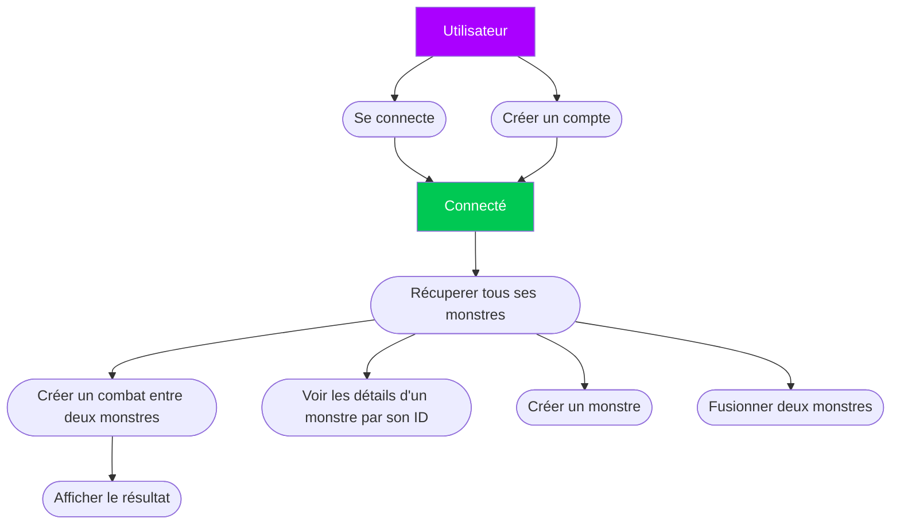
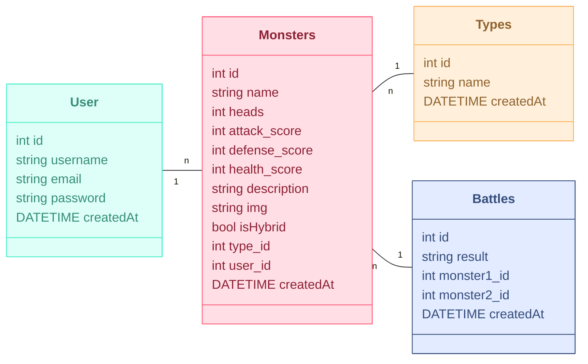

    # 🐲 Bestiarium API — PHP Native REST API

    Une API REST en PHP natif permettant de créer, fusionner et faire combattre des créatures mythologiques.

    ---

    ## 📌 Fonctionnalités

    - ✅ Inscription / Connexion (JWT)
    - ✅ CRUD Monstres
    - ✅ Génération IA (stats, description, image) via Pollinations.ai
    - ✅ Fusion de monstres en hybrides
    - ✅ Gestion de combats avec suppression du perdant
    - ✅ Base SQLite avec seeder
    - ✅ Tests via Postman

    ## 🏗️ Architecture & Technologies

    | Technologie | Rôle / Justification |
    |------------|----------------------|
    | **PHP 8+ natif** | Attentus du projet sont en PHP natif |
    | **SQLite + PDO** | Léger, portable, idéal pour un petit projet |
    | **JWT (firebase/php-jwt)** | Authentification stateless |
    | **Pollinations.ai** | Génération IA gratuite (stats, images, descriptions) |
    | **Postman** | Tests des endpoints, facile à utiliser et je suis à l'aise avec Postman |

    ## 📁 Structure du projet

    ```
    bestiarium/
    ├── crud/
        # Collections et variables Postman
    ├── images/
        # Images des monstres
    ├── includes/
    │   ├── controllers/     # Contrôleurs (auth, monsters, etc.)
    │   ├── models/         # Classes modèles
    │   ├── db/            # Connexion base de données
    │   └── pollinations/  # Prompts pour l'IA
    ├── vendor/           # Dépendances Composer et Firebase
    └── index.php         # Point d'entrée avec routes de l'API
    └── README.md        # Documentation du projet
    └── seed.php        # Permet de rapidement peupler la base de donnée


    > 📎 Diagramme UML & schéma BDD à ajoutés ((installer l'extension Mermaid preview))

Diagramme UML : 


Schéma de la BDD : 




    ## ⚙️ Installation & Lancement

    - git clone https://github.com/GitGudMax98/Bestiarium.git
    - cd bestiarium
    - composer install
    - php -S localhost:8000

    ## 🔧 Peupler la base de donnée rapidement

    Pour peupler la base de données avec des données de test ouvrez le terminal dans seed.php et tapez :

    php seed.php

    Cela va créer :
    - Un utilisateur de test (test@example.com / password123)
    - 5 monstres de base (Dragon, Hydre, Griffon, Cerbère, Chimère)

    La génération de ces données peut prendre un petit instant.

    Ces données permettent de tester rapidement les fonctionnalités de l'API.

    ## 🔑 Tests avec Postman

    L'API utilise JWT pour l'authentification. Voici comment tester avec Postman :

    Les content type sont à remplir dans l'onglet Body en raw


    1. Créer un compte (si pas déjà fait automatiquement à travers la méthode pour peupler rapidement la base de donnée):
    ```http
    POST http://localhost:8000/register
    Content-Type: application/json

    {
        "username": "test",
        "email": "test@test.com",
        "password": "password123"
    }
    ```

    2. Se connecter pour obtenir un token :
    ```http
    POST http://localhost:8000/login
    Content-Type: application/json

    {
        "email": "test@test.com",
        "password": "password123"
    }
    ```

    Vous pourrez ensuite utiliser les routes suivantes (une fois connecté il est necessaire d'inclure
    le bearer token reçu lors de la connexion dans Authorization, Auth type : Bearer Token dans
    les routes Monster, Hybrid et Battle)

    ## 📡 Points d'entrée API

    ### Authentification : Permet de créer un compte si pas déjà fait avec le seed.php

    - `POST /register` - Créer un compte
    ```json
    {
    "username": "John",
    "email": "john.doe@gmail.com",
    "password": "johndoe63"
    }

    Exemple de réponse 200 ok :
    {
        "message": "Utilisateur créé avec succès",
        "user": {
            "id": 1,
            "username": "John",
            "email": "john.doe@gmail.com"
        }
    }

    - `POST /login` - Permet de se connecter et d'obtenir un bearer token
    ```json
    {
    "email": "john.doe@gmail.com",
    "password": "johndoe63"
    }   

    Exemple de réponse 200 ok :
    {
        "message": "Connexion réussie",
        "token": "eyJ0eXAiOiJKV1QiLCJhbGciOiJIUzI1NiJ9MjY5MjU0N..."
    }

    ### Monstres

    - `POST /monster/create` - Créer un monstre
    ```json
    {
        "name": "Dragon",
        "type": "Reptile",
        "heads": 3
    }

    Exemple de réponse 200 ok : 

    {
        "message": "Monstre créé avec succès",
        "monster": {
            "id": 24,
            "name": "Cerberus",
            "type_id": 22,
            "heads": 6,
            "attack_score": 85,
            "defense_score": 70,
            "health_score": 420,
            "description": "Cerberus, le Gardien Flamboyant, est une créature imposante d’un blanc incandescent...",
            "img": "monster_1762692656.png",
            "user_id": 8
        }
    }

    - `GET /monster/all` - Liste des monstres

    Exemple de réponse 200 ok :

    {
        "user_id": 8,
        "monsters": [
            {
                "id": 23,
                "name": "Glacius",
                "heads": 8,
                "attack_score": 82,
                "defense_score": 88,
                "health_score": 420,
                "description": "Glacius est un monstre gigantesque...,
                "is_hybrid": 0,
                "type_id": 21,
                "user_id": 8,
                "createdAt": "2025-11-09 12:50:32"
            },
            {
                "id": 24,
                "name": "Cerberus",
                "heads": 6,
                "attack_score": 85,
                "defense_score": 70,
                "health_score": 420,
                "description": "Cerberus, le Gardien Flamboyant, est une créature imposante...,
                "img": "monster_1762692656.png",
                "is_hybrid": 0,
                "type_id": 22,
                "user_id": 8,
                "createdAt": "2025-11-09 12:50:56"
            }
        ]
    }

    - `GET /monster/show/{id}` - Détails d'un monstre

    Exemple de réponse 200 ok : 

    {
        "id": 23,
        "name": "Glacius",
        "heads": 8,
        "attack_score": 82,
        "defense_score": 88,
        "health_score": 420,
        "description": "Glacius est un monstre gigantesque aux huit têtes...,
        "is_hybrid": 0,
        "type_id": 21,
        "user_id": 8,
        "createdAt": "2025-11-09 12:50:32"
    }

    - `DELETE /monster/delete/{id}` - Supprimer un monstre

    Exemple de réponse 200 ok :

    {
        "message": "Monstre supprimé avec succès",
        "deleted_monster": {
            "id": 25,
            "name": "Hulk",
            "heads": 1,
            "attack_score": 85,
            "defense_score": 70,
            "health_score": 450,
            "description": "Dans l'obscurité brumeuse d’un univers fantasy, émerge Hulk, un géant vert...,
            "is_hybrid": 0,
            "type_id": 23,
            "user_id": 8,
            "createdAt": "2025-11-09 12:52:16"
        }
    }

    ### Hybrides

    - `POST /hybrid/create` - Créer un hybride
    ```json
    {
        "parent1_id": 1,
        "parent2_id": 2
    }

    Exemple de réponse 200 ok :

    {
        "message": "Monstre hybride créé avec succès",
        "hybrid": {
            "id": 31,
            "name": "Hulgyor",
            "parents": [
                "Hulk",
                "Cygor"
            ],
            "attack_score": 85,
            "defense_score": 74,
            "health_score": 460,
            "heads": 1,
            "description": "Né d'une fusion brute de terre et de chaos, Hulgyor se dresse...",
            "img": "hybrid_1762693461.png"
        }
    }
    ```

    ### Combats

    - `POST /battle/create` - Faire combattre deux monstres
    ```json
    {
        "monster1_id": 1,
        "monster2_id": 2
    }

    Exemple de réponse 200 ok :

    {
        "message": "Combat créé avec succès",
        "battle": {
            "id": 10,
            "monster1": "Glacius",
            "monster2": "Cerberus",
            "vainqueur": "Glacius",
            "perdant_supprime": "Cerberus"
        }
    }
    ```